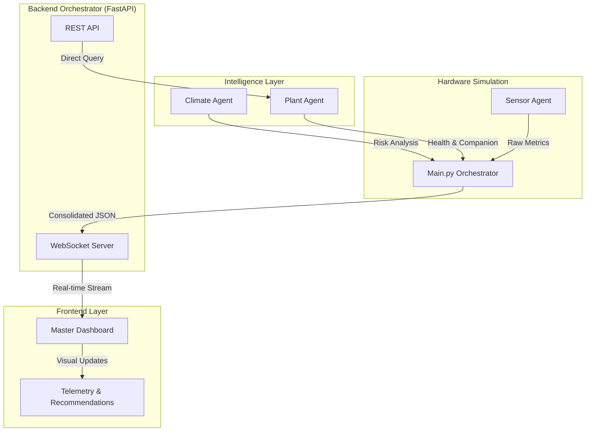

# 🏮 AgriSphere - Master Multi-Agent Dashboard

[](https://python.org)
[](https://fastapi.tiangolo.com)
[](https://opensource.org/licenses/MIT)

> **AgriSphere** is an advanced, multi-agent AI framework designed for modern precision agriculture. It integrates diverse data streams—from soil telemetry to global climate patterns—into a unified, real-time intelligence engine.

---

## 🚀 Key Features
- **🤖 Multi-Agent Orchestration**: Synchronized coordination between `Sensor`, `Climate`, and `Smart Plant` agents.
- **⚡ Real-Time Telemetry**: Fluid WebSocket-driven dashboard with 3-second update cycles and micro-animations.
- **🛡️ Cybersecurity Hardened**: Built with strict Pydantic validation, CORS lockdown, and async error isolation.
- **🌿 Intelligent Plant Care**: Automated health checks, companion planting recommendations, and environmental risk assessment.
- **📱 Glassmorphism UI**: High-performance Vanilla JS/CSS dashboard with responsive design for mobile and desktop.

---

## 🏗️ System Architecture



---

## 🧠 Agent Logic Deep Dive

### 📡 Precision Sensor Agent
- **Metrics**: Simulates Soil Moisture (10-60%), Soil Temp (15-35°C), and Air Humidity (30-80%).
- **Thresholds**: Triggers irrigation warnings if moisture falls below **30%**.

### 🌍 Climate Intelligence Agent
- **Thresholds**: 
  - `Heat Wave`: Temp > 40°C
  - `Flood Risk`: Rainfall > 80mm
- **Insight**: Provides predictive recommendations based on environmental risk assessments.

### 🌿 Urban Smart Plant Agent (Tomato Focus)
- **Real-time Context**: Inherits metrics from the Sensor Agent to provide live care advice.
- **Companion Discovery**: Uses an internal Knowledge Graph to recommend plants like **Basil**, **Marigold**, and **Onion**.

---

## 🛡️ Cybersecurity & Hardening
The system is built with a "Security-First" mindset to protect agricultural data:
- **CORS Restricted**: API only accepts requests from trusted local origins.
- **Pydantic Validation**: Every data packet is validated against strict schemas (length, type, ranges).
- **Sanitized Logic**: All agent inputs are length-limited to prevent injection or DoS attacks.
- **Async Resilience**: Isolated `try-except` blocks ensure that a malfunction in one agent doesn't bring down the platform.

---

## 🛠️ Setup & Installation

### 1. Prerequisites
- Python 3.9+ 
- Virtual Environment (recommended)

### 2. Installation
```bash
# Install dependencies
pip install fastapi uvicorn pydantic websockets
```

### 3. Launching the Platform
```bash
cd backend
python main.py
```
> Access the dashboard at `http://localhost:8000`

---

## 📡 API Documentation
### WebSocket: `/ws/dashboard`
Streams a unified payload every 3 seconds:
```json
{
  "sensor": { "status": "ok", "data": { "soil_moisture": 45, ... } },
  "climate": { "risk": "Normal", ... },
  "plant": { "recommendation": "..." }
}
```

### REST: `POST /ask-agent`
Directly query an agent with validated payloads.

---

## 👥 Contributors
- **Member 4**: Urban Smart Plant Agent Logic & Integration Coordinator.
- **Member 3**: Precision Sensor Agent Simulation.
- **Member 2**: Climate Intelligence Engine.

**AgriSphere - Empowering the future of precision farming.**
